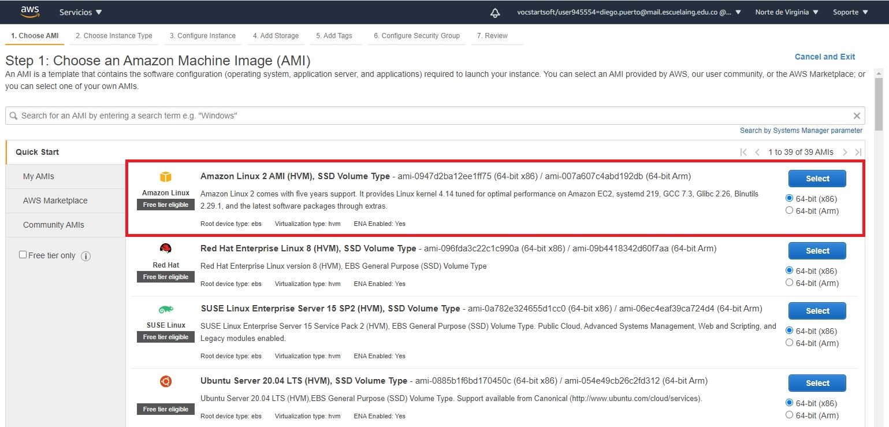
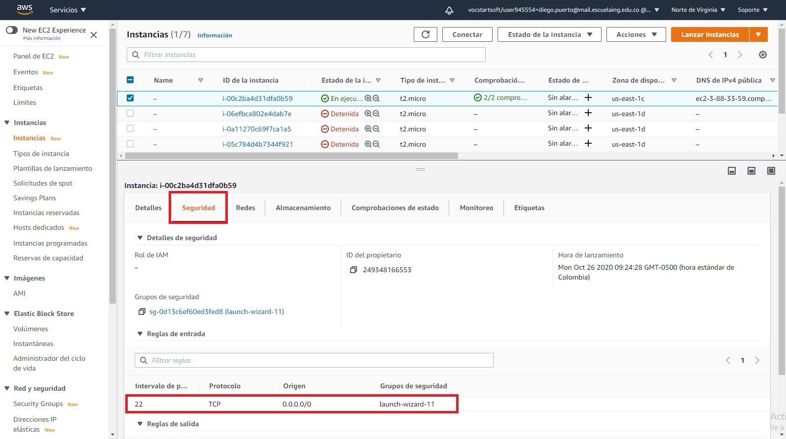
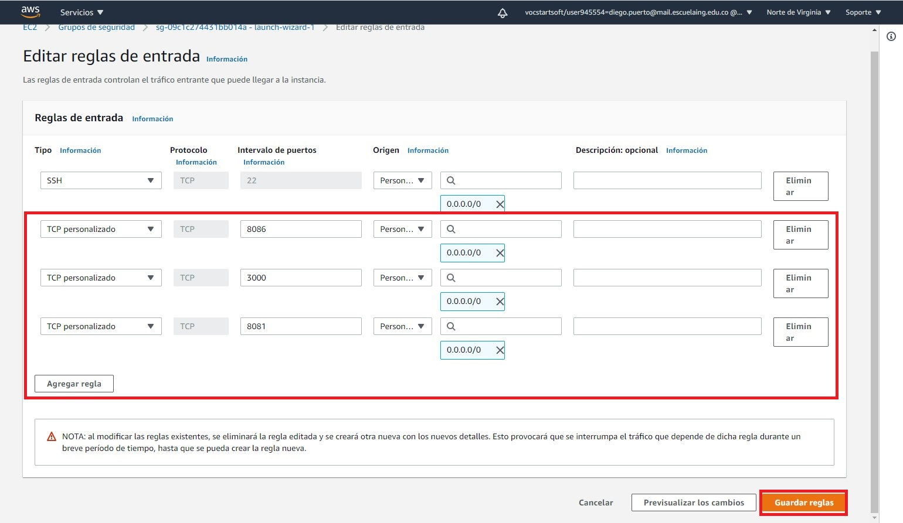

# Despliegue en EC2

## Creación de instancia EC2 en AWS

Nota: si no tiene una cuenta en AWS [Cómo crear una cuenta en AWS Educate](https://www.youtube.com/watch?v=8DrcNddARLo&feature=youtu.be)

1. En la Consola de administración de AWS seleccionar ```Ejecute una máquina virtual
Con EC2``` 


2. Seleccionar ```Amazon Linux 2 AMI (HVM), SSD Volume Type``` en ```64-bit (x86)```



3. Seleccionar tipo de instancia ```t2.micro (- ECUs, 1 vCPUs, 2.5 GHz, -, 1 GiB memory, EBS only)``` (por defecto)


4. Seleccionar ```Review And Launch``` > ```Launch```
5. Seleccionar ```Create a new key pair``` y definir su nombre. Generará un par de llaves para permitir la conexión a la instancia EC2
6. Seleccionar ```Download key pair```, esto descargará la llave privada de la forma <keyName>.pem


7. Una vez teniendo el archivo .pem seleccionar ```Launch Inatances```
8. Al ver las instancias estará inicializando la EC2

## Hacer puertos accesibles de una inatancia EC2
Luego de que la instancia de EC2 esté en ejecución y lista para ser accedida:


Especificar los puertos para hacerlos accesibles y realizar conexiones a la instancia EC2:
1. Luego de seleccionar la instancia creada, ir a la pestaña ```Seguridad```, allí puede ver las reglas de entrada, por defecto solo está habilitado el puerto 22



2. Para habilitar más puertos, dentro de la misma pestaña hay un link que contiene ```launch-wizard```, seleccionarlo
3. Seleccionar ```Editar reglas de entrada``` > ```Agragar regla```, configure los puertos que desea que sean accesibles desde afuera (puede establecer intervalos o puertos individuales), establecer su origen como 0.0.0.0/0 en todos


- Si va a configurar los usuarios y la utenticación de ```influxDB``` por medio de la API REST, es necesario abrir el puerto 8086
- Para usar la ```web UI``` de Flink, es necesario abrir el puerto 8081
- Para acceder a la ```web UI``` de Grafana, es necesario abrir el puerto 3000



## Realizar conexión SSH con la EC2 (Linux o subsistema Ubuntu en Windows)
1. Al seleccionar la instancia, ir a ```Acciones``` > ```Conectar```, en la pestaña ```Cliente SSH``` se dan los pasos necesarios para realizar la conexión (usando el subsistema puede ser necesario agregar ```sudo``` al inicio del comando de conexión SSH)

Al conectarse debería ver algo como lo siguiente:


así tiene acceso y manipulación sobre la instancia EC2

## Instalar Docker en una inatancia EC2
En la consola de EC2:
1. ```sudo yum update -y```
2. ```sudo yum install docker```
3. ```sudo service docker start```
4. ```sudo usermod -a -G docker ec2-user```

Luego de esto, es necesario cerrar la conexión SSH (```exit``` en la consola EC2) y volver a abrirla

Para poder ejecutar el comando Docker-compose en EC2: [Instalación de docker-compose](https://docs.docker.com/compose/install/)

Para comprobar que Docker fue instalado exitosamente puede ejecutar ```docker --version```, para comprobar que el servicio se esta ejecutando ```docker ps```(no debería mostrar errores) y para comprobar que puede ejecutar el comando docker-compose ```docker-compose --version```:


## Instalar Apache Maven & Java 8 en una inatancia EC2

Para poder ejecutar el proyecto Maven de ```simple-flink-job```, es necesario [instalar Maven y Java 8](https://docs.aws.amazon.com/neptune/latest/userguide/iam-auth-connect-prerq.html) en la instancia EC2.

## Transferir zip del proyecto
Es recomendable tener el ZIP del proyecto en donde está el archivo .pem para transferirlo con facilidad


1. Se usará una conexión SFTP para esto, el comando para generar la conexión SFTP es similar al de la conexión SSH pero justamente reemplazando ```ssh``` por ```sftp```


2. Ya dentro de la consola SFTP, ejecutar ```put <proyecto>.zip```.


3. Al volver a la consola que tiene la conexión SSH o conectarse nuevamente, se puede ver el archivo .zip en la instancia EC2. Para descomprimir el zip ```unzip <proyecto>.zip```


## Detalles en EC2
En este punto ya debería tener el archivo del proyecto, ```docker```, ```docker-compose```, ```Maven``` y ```Java 8``` instalados en su instancia EC2.

1. Al ejecutar el docker-compose dentro de EC2, puede que arroje el error ```there is insufficient memory for the java runtime environment to continue```, para esto se muestra una solución en [JRE out of memory in Docke](https://stackoverflow.com/questions/45129299/jre-out-of-memory-in-docker)

2. Para asegurar que los servicios se ejecutan correctamente (confirmar que el estado de todos es ```Up```), con el comando ```docker ps -a``` debería ver algo como:


Para acceder a los servicios de Docker que ofrecen una ```web UI```, se puede consultar en el browser ya sea por su dirección ipv4 pública o por su correspondiente DNS, cada uno de ellos. Estos son visibles en la pestaña ```Detalles``` de la instancia, específicamente en ```Dirección IPv4 pública``` o ```DNS de IPv4 pública```


Por ejemplo, el acceso a Grafana debería poderse consultar por el puerto 3000


**En este punto, ya debería cumplir todos los prerrequisitos para llevar su solución local del laboratorio 5, hacia una instancia EC2.**